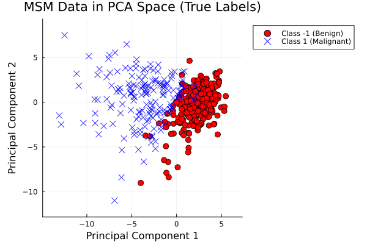
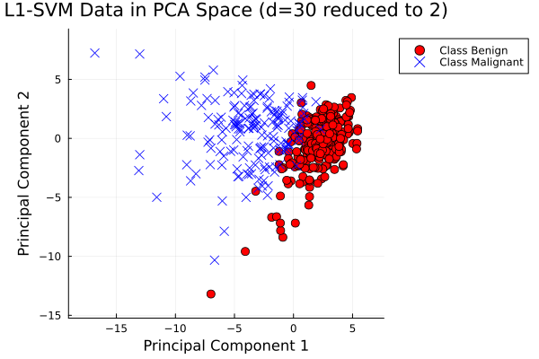
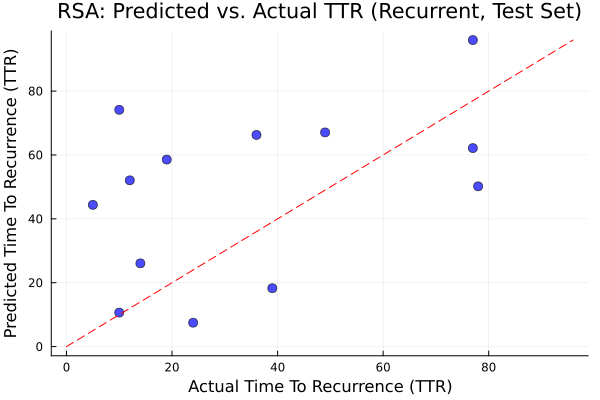
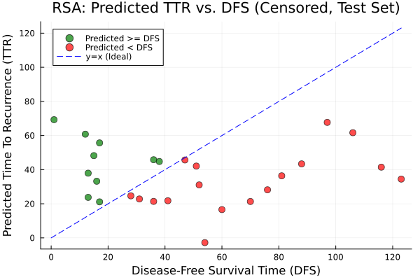

# breast-cancer-lp-julia

Julia project for MATH 271 (Spring 2025, Carleton College) exploring breast cancer diagnosis and prognosis using linear programming. This repository uses the Wisconsin Breast Cancer Diagnostic dataset to build interpretable, optimization-based models and compare them against traditional machine learning approaches.

The project implements:

- **L1-SVM (Linear-Programming Support Vector Machine)** for classifying malignant vs. benign tumors
- **MSM (Multi-Sphere Model)** as a geometry-based classifier
- **RSA (Recurrence Surface Approximation)** for predicting cancer recurrence time

The overarching goal is to evaluate how effective optimization-based approaches can be in medical prediction tasks, and whether they offer interpretability advantages over black-box models.

---

## Project Structure

- `LICENSE`
- `README.md`
- `data/`
- `images/` — figures generated during analysis
- `notebooks/` — Jupyter notebooks with LP formulations and experiments
- `report.pdf` — complete final report

---

## Project Overview

This project formulates breast-cancer classification and recurrence prediction using various linear programming approaches. The main focus is on:

- Data preprocessing and feature engineering
- Exploratory data analysis, including correlation and PCA
- LP formulation of the L1-SVM and RSA models using JuMP
- Comparative performance analysis between L1-SVM and MSM
- Error analysis and interpretability
- Visualization of PCA separation, decision boundaries, and recurrence predictions

Complete methodology and full results are available in `report.pdf`.

---

## Classification Performance

### **Confusion Matrices — L1-SVM vs. MSM**

| **Metric**           | **L1-SVM** | **MSM**    |
| -------------------- | ---------- | ---------- |
| True Positives (TP)  | 40         | 23         |
| True Negatives (TN)  | 73         | 48         |
| False Positives (FP) | 0          | 19         |
| False Negatives (FN) | 1          | 24         |
| **Accuracy**         | **99.12%** | **62.28%** |
| **Precision**        | **100.0%** | **48.94%** |
| **Recall**           | **97.56%** | **54.76%** |
| **F1-Score**         | **98.77%** | **51.69%** |
| **Specificity**      | **100.0%** | **66.67%** |

### Interpretation

**L1-SVM**

- Nearly perfect classifier
- No false positives, extremely important in medical contexts
- Very high recall (97.56%), missing only one malignant case
- Sparse and interpretable weights highlight key tumor features

**MSM**

- Struggles with overlapping feature structures
- Many false positives and false negatives
- Accuracy drops to ~62%
- Sphere-based boundaries are too rigid for complex, high-dimensional biological data

---

### **PCA Visualization of MSM — True Labels**

  

Benign and malignant cases are not clearly separated, especially in the center. This overlap explains why models cannot achieve perfect accuracy—it’s a challenging dataset. The L1-SVM still performs well, suggesting it effectively focuses on the most important features using optimization and regularization, even if the two-dimensional PCA visualization doesn’t show a perfect split.

---

### **PCA Visualization of L1-SVM — True Labels**

  

After PCA, the two classes overlap considerably. Benign cases cluster mostly on the right, malignant cases on the left, but a central region contains mixed cases. This illustrates why a soft-margin SVM—which allows some misclassifications—is useful. A decision boundary would aim to separate the classes as best as possible while tolerating overlap, improving overall predictive performance.

---

## Predicting Cancer Recurrence

### **RSA Model — Confusion Matrix**

| **Metric**               | **RSA**    |
| ------------------------ | ---------- |
| True Positives (TP)      | 2          |
| True Negatives (TN)      | 26         |
| False Positives (FP)     | 1          |
| False Negatives (FN)     | 11         |
| **Accuracy**             | **70.0%**  |
| **Precision**            | **66.67%** |
| **Recall (Sensitivity)** | **15.38%** |
| **F1-Score**             | **25.0%**  |
| **Specificity**          | **96.3%**  |

### Interpretation

The RSA model demonstrates:

- **Strong specificity (96.3%)** — rarely misclassifies non-recurrent patients
- **Weak recall (15.38%)** — fails to detect most actual recurrence cases
- **Moderate precision (66.67%)** — when predicting recurrence, it is usually correct
- **Low F1-score (25.0%)** — indicates a poor balance between precision and recall

In short:  
**RSA effectively rules out recurrence but struggles to identify patients who will recur.** This suggests that predicting recurrence may require more complex features, nonlinear modeling, or survival analysis methods.

---

### **RSA Model — Scatter Plots**

  

  

- **Left plot:** Predicted vs. actual Time To Recurrence (TTR) for recurrent patients. Points near the red dashed line indicate accurate predictions. Some cases are over- or underestimated, highlighting the challenge of exact TTR prediction.
- **Right plot:** Predicted TTR vs. Disease-Free Survival (DFS) for censored patients. Green points indicate predicted TTR ≥ DFS (desired), red points indicate predicted TTR < DFS (undesired). The model predicts well for many patients but struggles with longer DFS times, suggesting some constraint violations were allowed in the optimization.

---

## Technologies Used

- **Julia** — core implementation
- **JuMP.jl** — optimization modeling
- **HiGHS / GLPK** — LP solvers
- **IJulia / Jupyter** — interactive environment

---

## Conclusion

This project demonstrates that **optimization-based models can be powerful and interpretable tools for medical prediction tasks**, but performance varies across model types:

- **L1-SVM** achieved **99% accuracy**, perfect precision, and nearly perfect recall. Sparse weights highlight the most important tumor features, providing interpretability.
- **MSM**, though geometrically intuitive, struggled with overlapping structures, leading to lower accuracy and more errors.
- **RSA recurrence model** was reliable for ruling out recurrence but poor at identifying true recurrence cases, suggesting more sophisticated modeling is required.

Overall, this work highlights the **strengths of LP-based classification**, the **limitations of geometric models**, and the **challenges of recurrence prediction**, providing a comprehensive optimization-focused exploration of a real biomedical dataset.
